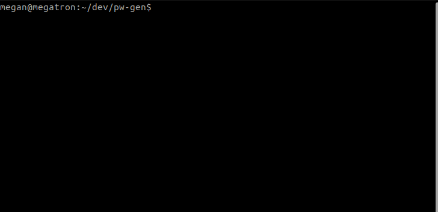

# Password Generator



Two PHP password generators, one functional, one class-based. Both generate passwords of a length and complexity set by user input.

## TOC

- [oop-generate.php](#oop-generatephp)
- [Docker](#docker)
  - [Use Image](#use-image)
  - [Use Dockerfile](#use-dockerfile)
    - [Build](#build)
    - [Run](#run)
- [functional-generate.php](#functional-generatephp)
- [Complexity](#complexity)
- [Releases](#releases)
  - [v1](#v1)

## oop-generate.php

I wrote this [bash script](/generate.sh) to generate a password from the `PasswordGenerator` class:

`$ ./generate.sh <length:int> <complexity:str[low|medium|high]>`

Alternatively, to generate the password in a php shell:

```
$ php -a
> require_once 'oop_generate.php';
> $password = new PasswordGenerator(<length:int>, <complexity:str[low|medium|high]>);
> echo $password;
```

## Docker

For overkill and practice, I dockerized the scripts: [password-generator image on dockerhub](https://hub.docker.com/r/devmegan/password-generator).

### Use Image

`$ docker run devmegan/password-generator:latest <length:int> <complexity:str[low|medium|high]>`

### Use Dockerfile

#### Build

`docker image build -t password-generator:latest .`

#### Run

`docker run --rm password-generator:latest <length:int> <complexity:str[low|medium|high]>`

## functional-generate.php

`$ php functional-generate.php <length:int> <complexity:str[low|medium|high]>`

## Complexity

Complexity Level | Pooled Characters
-- | --
low | lowercase letters, numbers
medium | lowercase letters, numbers, uppercase letters
high | lowercase letters, numbers, uppercase letters, symbols

---

## Releases

For full log of changes and releases, see [changelog](/CHANEGELOG.md).

### v1

- [v1.1.0 Bash Arg Error Handling](https://github.com/devmegan/password-generator/releases/tag/v.1.1.0) (23-03-26)
- [v1.0.0 Bash-Powered Password Generator in PHP](https://github.com/devmegan/password-generator/releases/tag/v1.0.0) (23-03-25)